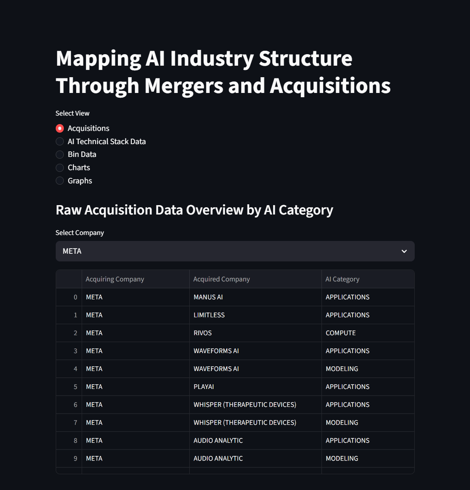
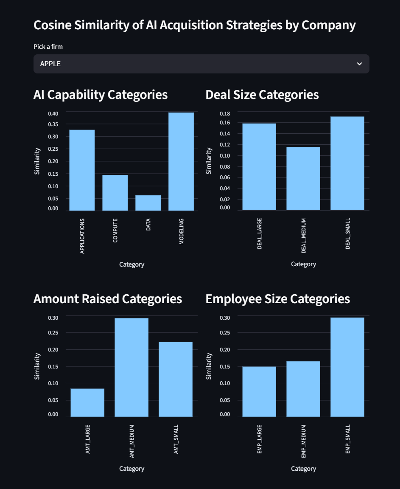
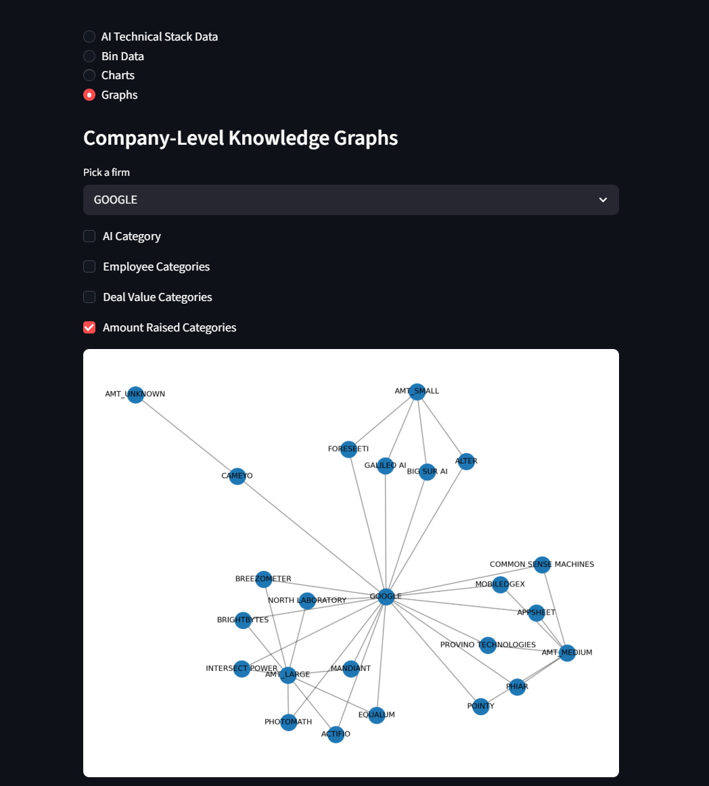

# Modeling AI Industry Structure Using Knowledge Graph Embeddings
## Abstract
This study examines how major technology firms position themselves within the artificial intelligence industry through their acquisition behavior. Focusing on Google, Apple, Meta, Amazon, and Microsoft, a knowledge graph of acquisition relationships is constructed using data from PitchBook. Using the knowledge graph, firms are represented in an embedding space using node2vec, which captures relationships based on the types of companies acquired, including data, compute, modeling, and application-based firms, as well as firm-level size characteristics, like deal value, funding, and employee count. Cosine similarity is then used to determine how closely firms relate to different AI categories and size variables within the embedding space. The results show that firms differ in how they position themselves across the AI industry, with some emphasizing application and modeling-based acquisitions, while others focus on compute-based or larger acquisitions. Overall, these findings suggest that acquisition behavior plays a central role in shaping how firms position themselves within the AI industry. A Streamlit dashboard was developed to help visualize the acquisition data, similarity scores, and industry structure.

## Author
Alex Dillon, American University

## Acknowledgements
This project was completed with guidance and support from Dr. Wu, whose feedback helped shape its development.

## Programming Languages, Platforms, and Libraries Used
### Programming Languages
 - Python
### Platforms
 - Google Colab
 - Streamlit (for dashboard deployment)
### Libraries
 - pandas
 - numpy
 - networkx
 - node2vec
 - PyKEEN
 - PyTorch
 - scikit-learn
 - matplotlib
 - Streamlit

## Installation, Compilation, and Running Instructions
### 1. Clone the Repository
```bash
git clone https://github.com/github_username/repo_name.git
cd your-repo-name
```
### 2. Install Required Dependencies
```bash
pip install streamlit node2vec pykeen pandas numpy networkx torch scikit-learn matplotlib
```
### 3. Prepare the Dataset
 - Place Dataset.xlsx in the appropriate directory
 - Update the file path in the code if needed:
```python
file_path = 'path_to_dataset/Dataset.xlsx'
```
### 4. Run the Application
```bash
python -m streamlit run app.py --server.port 8502 --server.address 0.0.0.0
```
### 5. Access the Application by Public URL
```bash
./cloudflared tunnel --url http://localhost:8502
```
A temporary public URL can be generated when running the project in Google Colab using Cloudflare tunnels.

## Instructions for Using the System
Once the dashboard is running, users can navigate between various views to explore the results:
### 1. Acquisitions Data View
- Select a firm (Google, Apple, Meta, Amazon, Microsoft)  
- View all acquired companies and their associated AI categories  

### 2. AI Technical Stack Data
- Displays similarity scores between firms and AI capability categories:
    - Data
    - Compute
    - Modeling
    - Applications

### 3. Bin Data
- Select a firm (Google, Apple, Meta, Amazon, Microsoft)  
- Displays similarity scores based on:
  - Deal value  
  - Amount raised  
  - Number of employees  

### 4. Bar Charts
- Select a firm (Google, Apple, Meta, Amazon, Microsoft)  
- Visualizes cosine similarity comparisons across:
  - AI capability categories  
  - Deal size  
  - Funding levels  
  - Employee size  

### 5. Knowledge Graphs
- Select a firm (Google, Apple, Meta, Amazon, Microsoft)  
- Displays an interactive knowledge graph of acquisitions  
- Toggle filters:
  - AI categories  
  - Deal value  
  - Amount raised  
  - Number of employees 

## Demo of System Use
An example use of the system is shown below:

1. Select a firm (e.x. Meta)
2. View acquisition patterns using raw data
3. Analyze similarity scores across AI categories and firm size characteristics
4. Understand strategies and patterns using charts
5. Explore the firm's acquisition network using knowledge graph visualization

## Example Runs and System Validation

### Acquisitions View


### Cosine Similarity Charts


### Knowledge Graph Visualization


### System Validation (Test Cases)
The system was tested to ensure that all of the components are accurate.

1. Data Verification
- Verified Dataset.xlsx loads correctly in Colab and Streamlit  
- Confirmed all triples are processed into the graph and matrix  

2. Knowledge Graph Construction
- Verified that all entities and relationships are correctly added to the graph  
- Ensured no missing or duplicate nodes in the graph structure  

3. Similarity Scores
- Confirmed values fall between -1 and 1  
- Examined cosine similarity scores against raw acquisition counts  

4. Dashboard Functionality
- Verified all Streamlit views load successfully 

## Contact Information
Alex Dillon  
Email: ad8993a@american.edu
